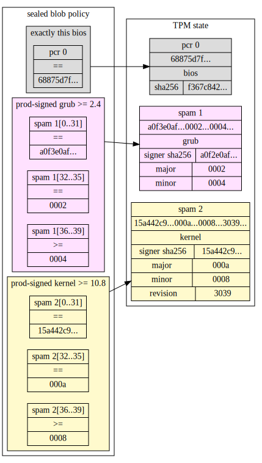

# tpm-spam
Spam = "**S**emantic **P**latform **A**ttestation **M**easurements"

Spams are strings of 64 bytes of data representing a boot stage identity measured into a TPM. Spams
for a given boot stage follow a given schema, which is then matched against by TPM policies.

For example, a spam for a signed Linux kernel might look like
```
15a442c9a5d7213c6d40560ef508f578f412b9c929629e5f173eca958e71964a0000000a00000008000030390000000000000000000000000000000000000000
```
where `15a442c9a5d7213c6d40560ef508f578f412b9c929629e5f173eca958e71964a` is the SHA-256 hash of the
verification key used to verify the kernel, the major version is `0000000a` (10), the minor version
is `00000008`, and the build revision is `00003039` (12345). The remaining bits are unused.

## Objective
Facilitate predictive TPM sealing with meaningful abstractions.

Storing meaningful, structured measurements allows scenarios such as predictively sealing secrets to
"this particular version, or later" of platform software. As an alternative to PCR values (which are
hashes-of-hashes), spam values contain context-specific meaningful data such as "who signed this" and
"what version was it signed as". Policies can then be constructed based on these semantics so that
policy-writers can identify software as fine or coarse grained as they prefer for each situation.



In this example, someone has sealed a data blob that is unsealable to the following software stack:
* The BIOS which results in PCR[00] being equal to 68875d7f...
* Any grub signed by a key whose hash is a0f3e0af, major version 2, minor version 4 or later
* Any kernel signed by a key whose hash is 15a442c9, major version 10, minor version 8 or later

Updating the BIOS will cause the data to no longer be unsealed (since it will change PCR 0). But
a minor version bump to either grub or kernel, as long as the same signing key is used, will still
match the policy and allow data to be unsealed.

This enables older data blobs to still be unsealable to updated software, while maintaining the
property that downgrading the software will render the blobs unavailable. This is impossible using
Platform Configuration Registers (PCRs).

## Background
TPMs contain banks of PCRs, which are arrays of 24 hash values. Software, configuration,
and well-meaning commentary are measured into PCRs by the boot stack on modern
computer systems. On a typical PC with UEFI, there are on the order of 100
measurements into the various PCRs.

Users of TPM may want to predictively seal data to expected PCR values. TPM
technically allows this, but PCRs don't make it easy. TCG defines a
[specification](https://trustedcomputinggroup.org/resource/tcg-efi-platform-specification/)
for the various measurements that EFI platforms should make so that firmware
and software code and configuration are accurately depicted in the PCRs for
explicit attestation by verifying a TCG log against PCR values.

On modern PCs, most PCRs are too brittle to reliably predictively seal data against.
Some unforeseen minor configuration change or phase of the moon may cause
software to extend different data into a PCR from one boot to the next, or the
data being extended might be a counter that is intended to change from one boot
to the next.

## Spam
A spam is an object in TPM memory that can only be overwritten after a reboot.
This object can be referenced in TPM policies, for example, policies on sealed
data.
Spam is implemented on current TPMs by use of NV (nonvolatile) objects, with
NV attributes that make them not-so nonvolatile. The spec calls these "Hybrid" indices.
* `TPMA_NV_ORDERLY` indicates this index can be cached in RAM until clean shutdown, and also causes 
  `TPMA_NV_WRITTEN` to be cleared on TPM Reset (cold reboot).
* `TPMA_NV_CLEAR_STCLEAR` clears the `TPMA_NV_WRITTEN` bit even on TPM Restart (warm reboot).
* An index with `TPMA_NV_WRITTEN` cleared may as well not have data in it.
  * Calls to `TPM2_NV_Read` and `TPM2_PolicyNV` fail if the index is not written, returning
    `TPM_RC_NV_UNINITIALIZED`.
* NV index size is 64 bytes, which is enough for a 256-bit hash (e.g., a verification key used to
  verify some signature containing the boot stage's code plus metadata) and 256 bits of metadata
  (e.g., some opaque hash of something else, four 64-bit version fields, a 32-character ASCII
  string, or some combination of semantically meaningful data for versioned policy assertions).

## Compatibility
Spam depends only on features in
[the current TPM spec](https://trustedcomputinggroup.org/resource/tpm-library-specification/),
but the spec calls out that hybrid NV index support is not mandatory for all TPMs:
[Part 1: revision 1.59](https://trustedcomputinggroup.org/wp-content/uploads/TCG_TPM2_r1p59_Part1_Architecture_pub.pdf)
says in particular in section 32.7 (NV Indices):

> An implementation is not required to support an arbitrary number of hybrid indices and is not
> required to support any ordinary hybrid index with a size of more than eight octets.

Spam uses TPMA_NV_ORDERLY to avoid wasted NV write cycles on each boot. However, to maintain
the desired security properties (spams reset on reboot), `TPMA_NV_CLEAR_STCLEAR` would be
sufficient in a modified spam implementation on TPMs that don't support larger ordinary hybrid
indices.

## Design details
Spams have a policy that allows writes only when `TPMA_NV_WRITTEN` is cleared, so they are
write-once-per-boot. This means that whichever piece of code on a system writes a particular spam
first, wins.

For technical reasons to do with the limitations of TPM NV indices, initializing spams requires
Platform authorization, which is reset to the Empty auth on reboot and intended to be set to a
random value and discarded by the system firmware.

Spam assumes that the software initializing all the spams is extended into PCR[00]. Fixing a bug or
vulnerability in that software should be reflected in PCR[00], and any policy that depends on spams
should also depend on PCR[00].

The anticipated schema of most spams (hash of key || version data) assumes that verification keys
for boot stages should not be universal. By including the hash of the verification key along with
whatever version metadata was signed, detailed access control restrictions
between various keys that may be known to software (for example, prod vs dev keys) can be delegated
to the authors of sealed blob policies. Some types of data need not be signed, and instead
could be included directly and/or hashed to produce a spam: for example, a small configuration
file.

Each boot phase after spam initialization should be measured into a spam before being launched.
Failure to measure a spam should cause the invalidation of PCR[00]. This prevents a piece of
software from modifying its own spam. Note that because spams are all defined (but not written) at
the beginning of the boot, measuring a spam is simply a write to an NV index that already exists
and has space in memory already allocated to it. The chain of measurements starts with the Root of
Trust for Measurement (RTM) in PCR[00] and extends through the boot chain as reflected in the spams.

After boot, the boot chain is reflected into PCR[00] and a collection of spams, e.g.:
* PCR[00]: BIOS (form: a hash of hashes)
* SPAM: Bootloader (form: hash of key used to verify GRUB || GRUB version)
* SPAM: Kernel (form: hash of key used to verify kernel || kernel version)

Spam allows policy authors to reference semantic measurements of code depending on the format of
the particular spam being referenced. For example, a kernel spam policy could require a particular
kernel verification key hash (e.g., the first 32 bytes of the spam) and a minimum major kernel
version (e.g., the next 4 bytes of the spam interpreted as a uint). This would allow secrets sealed
for a particular kernel to still be unsealable by an updated kernel (signed by the same key), while
allowing future secrets sealed to that kernel not to be unsealable by a rolled-back kernel.

With AND/OR policy tree semantics (not yet discussed), a policy could be written to facilitate
rotation of the keys used to sign software, for example
* Either:
  * Kernel is signed by (the old key)
  * Kernel is signed by (the new key)
* Plus:
  * Kernel is signed as major version X
  * Kernel is signed as minor version at least Y

The index space of spam is much sparser than PCRs: 16 bits or 65536 possible spams. In a given
environment, each spam index should be unique per purpose, and encode stable formatting semantics.

Because a system could have many spams, all stored separately, complex systems with multiple pieces
of firmware (for example, BMC/NIC firmware), whose boot chain is less of a linear chain and more of
a directed acyclical graph, can still be represented and secrets can be sealed to expected acceptable
states of all measured parts.
